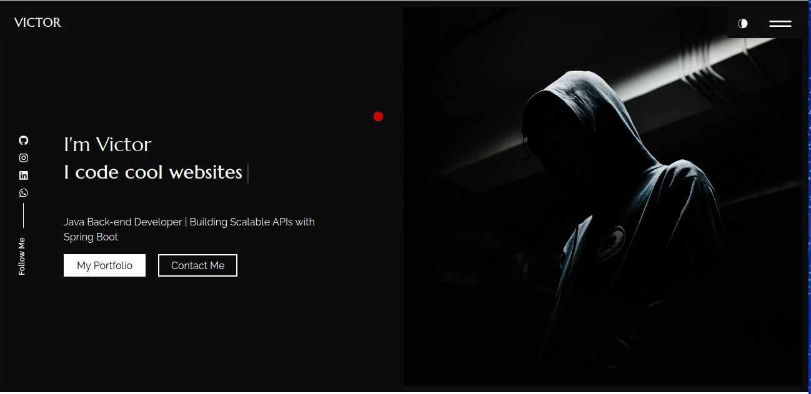

# 👋 Hello, I'm Victor!

🎓 **Systems Analysis and Development student** at UNIASSELVI.  
💻 Passionate about **back-end development**, especially with **Java**, **Spring Boot**, and **Node.js**.  
🌱 Currently learning more about **APIs integration**, **Docker**, and **advanced Spring Boot**.  
🎯 My goal: Contribute to impactful projects and grow as a software developer.

---

## 📷 Portfolio
  
  
**Check out my full portfolio and projects.**

---

## 🚀 Skills

### **Languages & Frameworks**
- 
- 
- 
- 
- 
- 
- 

### **Databases**
- 
- 

### **Tools & Platforms**
- 
- 
- 
- 
- 
- 
- 
- 
- 

### **Other Skills**
- **Unit Testing**: Expertise in writing and executing tests with **JUnit** and **Mockito**.
- **API Integration**: Proficient in integrating with third-party APIs and designing RESTful services (e.g., **Google Books API**, **Payment APIs**).
- **Database Design & SQL**: Strong experience in designing and optimizing relational databases.
- **CI/CD**: Familiar with **Continuous Integration** and **Continuous Delivery** pipelines.
- **Agile Methodology**: Experience working with **Scrum** and **Kanban**.

---

## 🌟 My Projects

### 📦 [E-commerce API](https://github.com/victor-engineer/ecommerce-backend)
- API to manage products, customers, and orders with **Spring Boot** and **PostgreSQL**.

### 📚 [Books API Integration](https://github.com/victor-engineer/books-api)
- Integration with **Google Books API** to search for books.

### 💰 [Personal Investment Manager](https://github.com/victor-engineer/investment-manager)
- App to track and manage **personal investment portfolios**.

---

## 📈 GitHub Stats

  

---

## 📫 Connect with me

- 
- 
- 

---

## 💬 Let's Build Something Amazing Together! 🚀
Feel free to contact me if you want to collaborate on exciting projects or if you have any questions about my work!

---

### 📌 Fun Fact:
I love to explore new technologies and implement innovative solutions. Always up for a challenge!

